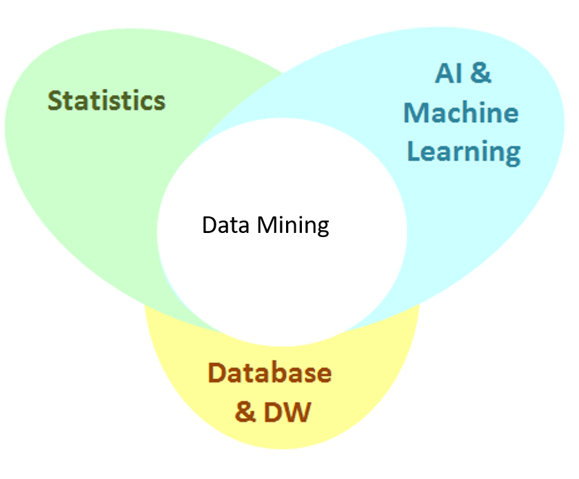
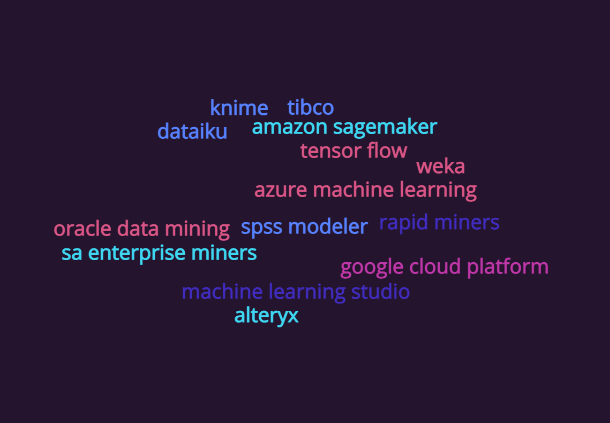

---
output:
  revealjs::revealjs_presentation:
    theme: night
    highlight: espresso
    center: true
    transition: concave
    self_contained: false
    css: style.css
    reveal_options:
    slideNumber: true
    previewLinks: true
---

# {data-background="#01123b" style="color:#d9555d;"}

<h1 style="color: #d9555d">Introducción a la Minería de Datos</h1>

# Muchos Conceptos.Muchos Buzzword.Una misma finalidad.{data-transition="fade-in" data-background="#01123b" style="color:white;"}

# El Concepto {data-background="#01123b" style="color:white;"}

Es el  <b>proceso de descubrimiento de patrones</b> 
en grandes datos incorporando:

::: {style="color: white;margin:20px;margin-top:50px"}

> * métodos  de Estadística,
> * sistemas de bases de datos 
> * y Aprendizaje de máquinas.
:::

# Minería de datos es un puente que une estas tecnologías

# Diferencias con el Análisis de Datos

 Análisis de Datos Es usado para probar modelos e hipótesis sobre un dataset para por ejemplo, encontrar la efectividad de una campaña de marketing de Uber Eats.

 Minería de Datos Utiliza Machine Learning y métodos estadísticos no paramétricos para descubrir patrones,correlaciones o anomalías ocultas en largos volúmenes de datos, por ejemplo, para encontrar la combinación óptima de ofertas de productos a mostrar en Uber Eats, a efectos de maximizar el consumo y rentabilidad.

# KDD(Knowledge Discovery in databases)

**Data mining** es también conocido como **KDD(Knowledge Discovery in Databases)** y se refiere a la extracción  de información implícita, desconocida y potencialmente útil desde datos almacenados en bases de datos.

## Proceso del KDD

## Limpieza de los datos.

La limpieza de la data es la etapa en donde se **eliminan** elementos ruidosos e irrelevantes de la colección de datos recopilados.

- Por ejemplo:

- Valores perdidos.
- Ruido o errores aleatorios en los datos.
- Discrepancias en los datos mediante reglas predefinidas.

## Integración de los datos.

Esta etapa consiste en **integrar** las distintas fuentes de datos recopiladas en un solo repositorio, dataset o datawarehouse. 

-Conocido como proceso **ETL.**

## Selección de los datos

En esta etapa se Esta etapa consiste en filtra solo los datos del repositorio que van a ser utilizados durante el análisis.Se pueden utilizar técnicas estadísticas para la selección de los datos más relevantes.

## Transformación de los datos

En esta etapa se En esta etapa se Esta etapa consiste en moldean y masajean los datos para darle la forma y dimensionalidad apropiada para el uso durante el análisis.

## Minado de datos

En la etapa de Minería de datos se utilizan técnicas analíticas que son utilizadas para detectar patrones potencialmente útiles.

Basado en los objetivos se debe decidir que tipo de técnicas utilizar, ya sea **modelos supervisados** o **modelos no supervisados**

## Representación del conocimiento

Una vez creados los insumos de los modelos de minería de datos, por lo general deben ser consumidos en medios como:

- reportes analíticos.
- Visualizaciones.
- Modelos de puntuaciones, reglas de clasificación o categorización.
- APIs.

# Técnicas comunes utilizadas en la Minería de datos

## Detección de anomalías

La identificación de datos no usuales con respecto al patrón normal, que pueden requerir investigación minuciosa.

- Ejemplos: Detección de fraude y Seguridad informatica.

##  Reglas de asociación

Las reglas de asociación buscan relaciones entre los datos.Por ejemplo, un supermercado puede analizar los patrones de compra para determinar los productos comprados por los consumidores para realizar ofertas.(Este análisis es conocido como **Market Basket Analysis**).

## Clustering

El análisis de agrupamiento o clustering tiene como objetivo catalogar los individuos u observaciones en grupos similares definidos por las características seleccionadas en el conjunto de datos.

Las observaciones dentro de estor grupos por lo general son similares dentro de si, pero diferentes con las observaciones de otros grupos.

Este análisis es usualmente utilizado para los modelos de segmentación de cartera de clientes, entre muchos otros usos.

## Regresión y clasificación

El **análisis de regresión** tiene como objetivo predecir los valores de una variable(objetivo), basado en  otras variables ( independientes).Cuando hablamos de **regresión** se utilizan **variables cuantitativas**, mientras que **clasificación**, se refiere a **variables cualitativas**.

Estas técnicas son conocidas usualmente como **Modelos Supervisados** y existen diversidad de algoritmos en el área de **Machine Learning**.

# Clase Asincrónica

<small> 1 - Investigar  un software de minería de datos entre la siguiente lista:</small>

<small> 2 - El análisis debe contener los siguientes aspectos:</small>

<small>- Tipo de licenciamiento.</small>
<small>- Procesos de KDD soportados.</small>
<small>- Algoritmos de Machine Learning/ Data Mining incluídos.</small>
<small>- Especialización del software.</small>
<small>- Ventajas y desventajas.</small>

# Tarea 1 (Individual)

Escoger alguna de las técnicas de minería de datos presentada hoy e investigar un caso de uso exitosos en la industria de su preferencia.

El análisis debe contener lo siguiente:

<small>- Técnica a utilizar e industria.</small>
<small>- Problema a resolver.</small>
<small>- Datos utilizados.</small>
<small>- Resultados generados en el caso de uso.</small>
<small>- Ejemplo de como el caso de uso fue implementado.</small>
<small>- Notas sobre los cambios positivos en la organización al implementar el caso de uso.</small>

